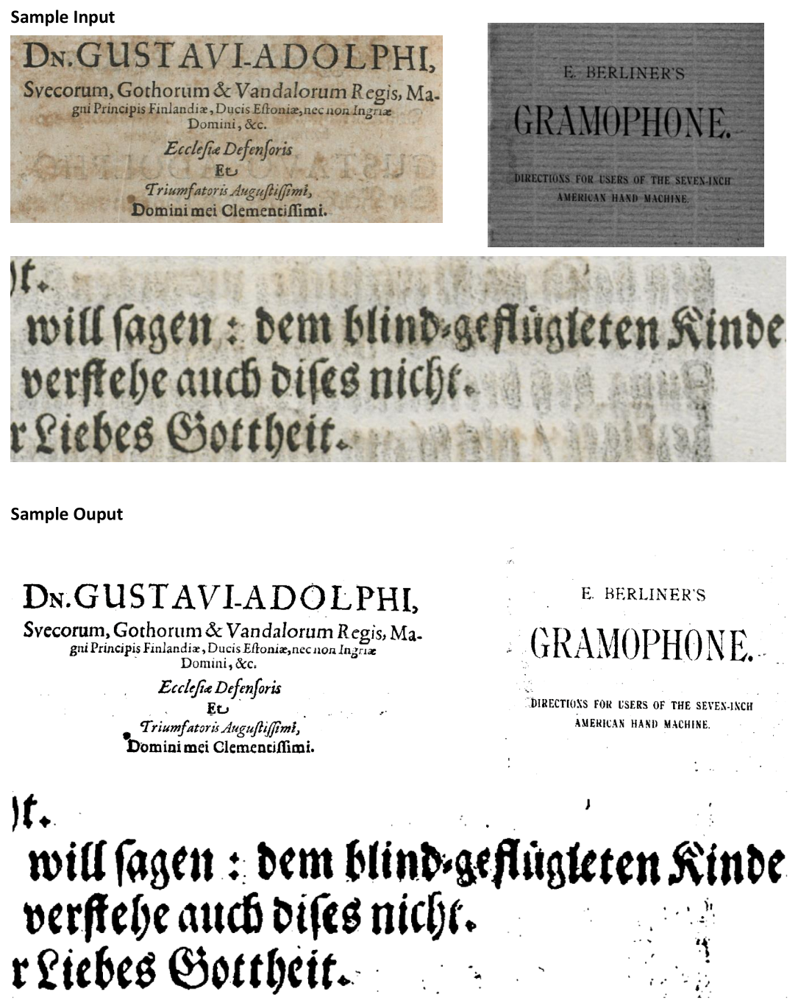

# Document-Image-Binarization
Document image binarisation is a form of image segmentation in which we attempt to segment a document image (for instance a scanned or photographed text document) into two classes: text and non-text.
The algoritmh to perform the image binarisation is the Otsu thresholding algorithm, the script is developed in Matlab.

